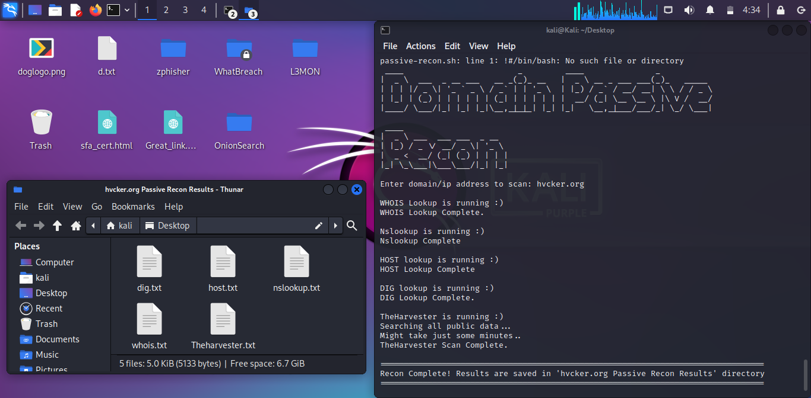

# DOMAIN RECON



A simple Bash script to automate passive reconnaissance for penetration testing and cybersecurity research.
Features

- WHOIS lookup
  Gathers registration details of the target domain/IP, including owner information, name servers, and contact details.

- Nslookup
  Resolves domain names to IP addresses and retrieves basic DNS information.

- Host lookup
  Provides detailed information about the DNS records associated with a domain, such as mail servers and name servers.

- DIG
  Performs advanced DNS queries to gather extensive DNS record information.

- Subfinder
  Enumerates subdomains passively using public sources, helping identify additional attack surfaces for the target domain.

- theHarvester
  Harvests email addresses, subdomains, hosts, and employee names from public sources.


## Tools Required 
Before Running, please ensure the following tools are installed on your system:
- whois
- dnsutils (for nslookup, host, dig)
- subfinder
- theHarvester

## Installation
#### Update package lists
```
sudo apt update
```
### Install tools
```
sudo apt install whois dnsutils theharvester -y
```
### Install Subfinder
```
sudo apt install subfinder
```

## How To Run
### Clone the repository
```
git clone https://github.com/codelassey/scripts-and-tools.git
cd scripts-and-tools/Passive\ Reconnaissance/
```
### Make the script executable
```
chmod +x passive-recon.sh
```
### Run the script
```
./passive-recon.sh
```


Run the script
```
./passive-recon.sh
```

[Connect WIth Me On LinkedIn](https://www.linkedin.com/in/prince-lassey-b90b80197/)
